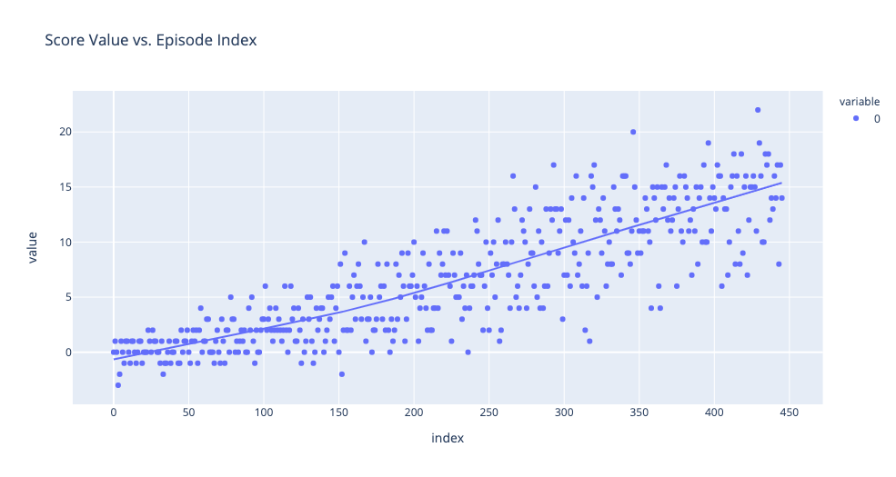
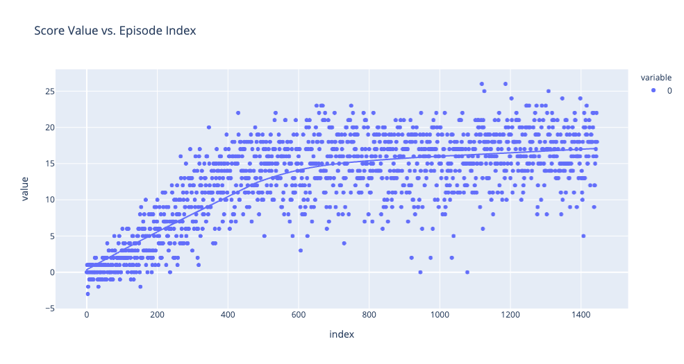

# Summary Report

## Learning Algorithm

### DQN

The reinforcement algorithm implemented here is following from DQN. DQN is based on the Q-learning reinforcement learning algorithm, and has a neural network (NN) as the basis for a function approximation.

DQN also has two key additional features that help the agent converge on a solution, even when using an unstable NN to approximate it's Q-table action values.

1. Replay Buffer
2. Fixed Q-targets

The implementation can be found in [dqn_agent.py](dqn_agent.py).

#### Replay Buffer

This is essentially a memory bank that the agent will reference when it is time execute the *learning* step of the algorithm. It is implemented as its own class, `ReplayBuffer`, in the same file as the main `Agent` class.

#### Fixed Q-targets

This feature of the algorithm improves the stability of learning, since it doesn't make updates to the function approximated Q-table on every timestep. Instead it will do this once in every `UPDATE_EVERY` timesteps, which helps to smooth out any changes in the target function.

#### Chosen Neural Network

Since the environment's state can be represented as a single vector of size 37, I've opted to go with a more simple NN. It has only two fully connected hidden layers, with relu activation functions, and a third fully connected output layer providing the action values directly to be used in place of a Q-table.

The implementation can be found in [model.py](model.py).

#### Hyperparameters

The hyperparameters used to train these saved weight files are as follows:

```
BUFFER_SIZE = int(1e5)  # replay buffer size
BATCH_SIZE = 64         # minibatch size
GAMMA = 0.99            # discount factor
TAU = 1e-3              # for soft update of target parameters
LR = 5e-4               # learning rate 
UPDATE_EVERY = 4        # how often to update the network
```

## Plot of Rewards

Following from the [training notebook](Training.ipynb) we can see how the average scores of the agent increases with the number or episodes used for training.

### Fast Solution

This figure shows the scores over the first ~450 episodes, going from knowing nothing to a model like the one saved by `solved_model.pt`

**This demonstrates that the model solved the environment in 346 episodes**, averaging a running score > 13 by episode 346.



### High Score

This figure shows the scores over the first ~1500 episodes, going from knowing nothing to a model like the one saved by `high_score_model.pt`



**This demonstrates the highest average score of over 17 in 100 consecutive episodes.**

## Ideas for Future Work

To improve the agent further, any of the following steps can be taken:
- optimize the hyperparamters by fine tuning or running a grid search over some search space. 
- try a more complex neural net function approximator
- try changing the reward function e.g. +2 for yellow bananas and -1 for blue bananas (but this would need to change the environment itself)